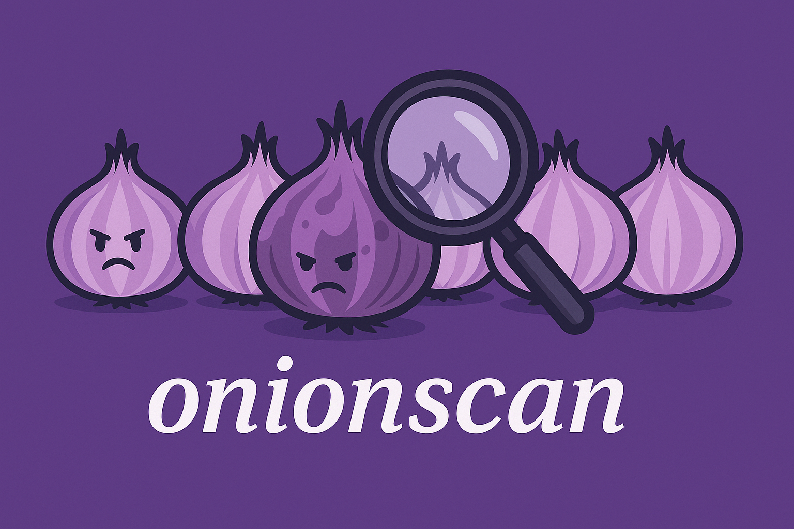

[](https://pkg.go.dev/github.com/nao1215/onionscan)
[](https://goreportcard.com/report/github.com/nao1215/onionscan)
[](https://github.com/nao1215/onionscan/actions/workflows/unit_test.yml)


# OnionScan



OnionScan is a security auditing tool for Tor hidden services (.onion addresses). It identifies OPSEC issues, configuration errors, and anonymity risks that could deanonymize hidden service operators.

This project is a complete rewrite inspired by the original [s-rah/onionscan](https://github.com/s-rah/onionscan), which had not been maintained for several years. Major enhancements include:

- **Tor v3 Support**: Full support for v3 onion addresses (56-character `.onion` addresses using ed25519 keys)
- **Embedded Tor**: No need to manually configure Tor - the tool handles it automatically
- **Enhanced Analyzers**: Additional security checks for modern threats (browser fingerprinting, API leaks, cloud services)
- **Multiple Output Formats**: JSON, Markdown, and text reports with severity-based categorization
- **Modern Go Codebase**: Built from scratch with Go 1.25+, clean architecture, and comprehensive test coverage

> [!IMPORTANT]
> **Legal Notice**: This tool is intended for legitimate purposes only, such as security research, penetration testing with authorization, and privacy auditing of your own services. Users are solely responsible for ensuring their use complies with all applicable laws and regulations. Do not use this tool for any illegal activities.

## Features

- **Embedded Tor Support**: Automatically starts a Tor daemon - no manual Tor configuration required
- **Comprehensive Security Analysis**: 16+ analyzers covering various attack vectors
- **Multiple Output Formats**: Text, JSON, and Markdown reports
- **Multi-Protocol Scanning**: HTTP/HTTPS, SSH, FTP, SMTP, and database protocols
- **Web Crawling**: Deep analysis with configurable crawl depth
- **Site-Specific Configuration**: Custom cookies, headers, and patterns per target

## Security Checks

### Deanonymization Risks
| Category | Description |
|----------|-------------|
| Email Addresses | Detects email addresses that could identify operators |
| Analytics IDs | Google Analytics, Facebook Pixel, and 11 other tracking services |
| Cryptocurrency Addresses | Bitcoin, Ethereum, Monero, and 8 other cryptocurrencies |
| Social Media Links | 16 platforms including Twitter, GitHub, Telegram |
| EXIF Metadata | GPS coordinates, camera info, timestamps in images |
| Private Keys | Tor keys, SSH keys, AWS credentials, API tokens |

### Security Misconfigurations
| Category | Description |
|----------|-------------|
| Server Headers | Version disclosure, security header analysis |
| Apache mod_status | Exposed server status pages |
| SSL/TLS Issues | Certificate problems, weak configurations |
| CSP Analysis | Content Security Policy weaknesses |

### Attack Surface Detection
| Category | Description |
|----------|-------------|
| Browser Fingerprinting | Canvas, WebGL, WebRTC, AudioContext fingerprinting |
| Malicious Patterns | Obfuscated JavaScript, hidden iframes, suspicious redirects |
| API Leaks | Swagger/OpenAPI, GraphQL endpoints, debug interfaces |
| Cloud Services | AWS, GCP, Azure, Cloudflare resource detection |

### Protocol Scanners
| Protocol | Port | Description |
|----------|------|-------------|
| HTTP/HTTPS | 80/443 | Web service detection and analysis |
| SSH | 22 | Banner grabbing, OS detection |
| FTP | 21 | Server software identification |
| SMTP | 25 | Mail server hostname extraction |
| MongoDB | 27017 | Database exposure detection |
| Redis | 6379 | Unauthenticated access detection |
| PostgreSQL | 5432 | Database service detection |
| MySQL | 3306 | Version disclosure analysis |

## Requirements

- **Go**: 1.25 or later
- **Tor**: Must be installed on your system (for embedded mode)

### Installing Tor

```bash
# Ubuntu/Debian
sudo apt update && sudo apt install tor

# Fedora/RHEL
sudo dnf install tor

# Arch Linux
sudo pacman -S tor

# macOS (Homebrew)
brew install tor

# Windows (Chocolatey)
choco install tor
```

## Installation

### Homebrew (macOS/Linux)

```bash
brew install nao1215/tap/onionscan
```

### Go Install

```bash
go install github.com/nao1215/onionscan/cmd/onionscan@latest
```

### Build from Source

```bash
git clone https://github.com/nao1215/onionscan.git
cd onionscan
go build -o onionscan ./cmd/onionscan
```

## Quick Start

### Basic Scan

```bash
# Scan a hidden service (starts embedded Tor automatically)
onionscan scan exampleonion.onion

# Scan multiple services
onionscan scan site1.onion site2.onion site3.onion
```

### Using External Tor

If you already have Tor running:

```bash
# Use existing Tor SOCKS proxy
onionscan scan --external-tor 127.0.0.1:9050 exampleonion.onion

# Use Tor Browser's proxy
onionscan scan --external-tor 127.0.0.1:9150 exampleonion.onion
```

### Output Formats

```bash
# JSON report
onionscan scan --json -o report.json exampleonion.onion

# Markdown report
onionscan scan --markdown -o report.md exampleonion.onion

# Text report to file
onionscan scan -o report.txt exampleonion.onion
```

### Scan Options

```bash
# Custom crawl depth
onionscan scan --depth 50 exampleonion.onion

# Limit maximum pages to crawl
onionscan scan --max-pages 200 exampleonion.onion

# Custom timeout
onionscan scan --timeout 3m exampleonion.onion

# Verbose logging
onionscan scan -v exampleonion.onion

# Concurrent scans
onionscan scan --batch 5 site1.onion site2.onion site3.onion
```

### CLI Options Reference

| Flag | Short | Default | Description |
|------|-------|---------|-------------|
| `--external-tor` | `-e` | (embedded) | Use external Tor proxy (e.g., `127.0.0.1:9050`) |
| `--tor-timeout` | `-T` | `3m` | Timeout for embedded Tor startup |
| `--timeout` | `-t` | `2m` | Connection timeout for each request |
| `--depth` | `-d` | `100` | Maximum crawl recursion depth |
| `--max-pages` | `-p` | `100` | Maximum pages to crawl per service |
| `--batch` | `-b` | `10` | Number of concurrent scans |
| `--config` | `-c` | `.onionscan` | Configuration file path |
| `--json` | `-j` | `false` | Output JSON report |
| `--markdown` | `-m` | `false` | Output Markdown report |
| `--output` | `-o` | (stdout) | Write report to file |
| `--verbose` | `-v` | `false` | Enable verbose logging |
| `--crawl-delay` | `-D` | `1s` | Delay between HTTP requests (politeness setting) |
| `--user-agent` | `-A` | `OnionScan/2.0` | User-Agent header for HTTP requests |
| `--max-body-size` | `-B` | `5MB` | Maximum response body size in bytes |

> [!NOTE]
> **Batch Mode Limitation**: When using `--batch` with a value greater than 1, site-specific configurations (cookies, headers, depth) are ignored. Use `--batch 1` to apply per-site settings from your configuration file.

### Politeness Settings

OnionScan includes "politeness" settings to avoid overwhelming hidden services:

```bash
# Slower, more polite scanning (2 second delay)
onionscan scan --crawl-delay 2s exampleonion.onion

# Faster scanning for authorized testing (500ms delay)
onionscan scan --crawl-delay 500ms exampleonion.onion

# Custom User-Agent
onionscan scan --user-agent "MyScanner/1.0" exampleonion.onion

# Limit response body size (useful for memory-constrained environments)
onionscan scan --max-body-size 1048576 exampleonion.onion  # 1MB
```

> [!TIP]
> **Be Respectful**: The default settings (1s delay, 5MB body limit) are conservative. Only reduce the delay for services you control or have explicit authorization to test aggressively.

### Secure Logging

OnionScan automatically sanitizes sensitive information in log output, even in verbose mode:

- **Sanitized**: Cookies, Authorization headers, API tokens, passwords, session IDs, private keys
- **Safe to share**: Logs can be shared for debugging without accidentally exposing secrets

```bash
# Verbose mode with automatic secret sanitization
onionscan scan -v exampleonion.onion

# Example output (secrets are masked):
# INFO request sent cookie=***REDACTED*** url=http://example.onion
```

### Data Storage

Scan results are automatically saved to a SQLite database following the XDG Base Directory specification:

| OS | Database Location |
|----|-------------------|
| Linux | `~/.local/share/onionscan/onionscan.db` |
| macOS | `~/Library/Application Support/onionscan/onionscan.db` |
| Windows | `%LOCALAPPDATA%\onionscan\onionscan.db` |

### Compare Scans

OnionScan stores scan results in a local database, allowing you to track changes over time:

```bash
# Compare latest two scans for a service
onionscan compare exampleonion.onion

# List all scan history for a service
onionscan compare -l exampleonion.onion

# List all scanned services in the database
onionscan compare -L

# Compare with a specific historical scan by ID
onionscan compare -i 5 exampleonion.onion

# Compare scans since a specific date
onionscan compare -s "2025-01-01" exampleonion.onion

# Output comparison in JSON format
onionscan compare -j exampleonion.onion

# Output comparison in Markdown format
onionscan compare -m exampleonion.onion
```

The comparison report shows:
- **New findings**: Issues that appeared since the previous scan
- **Resolved findings**: Issues that are no longer present
- **Risk change**: Whether the overall security posture improved, worsened, or stayed the same

## Configuration

### Initialize Configuration File

```bash
onionscan init
```

This creates `.onionscan` in the current directory with default settings.

### Configuration File Format

```yaml
# Default settings for all sites
defaults:
  cookie: ""
  depth: 100
  headers: {}
  ignore_patterns: []
  follow_patterns: []

# Site-specific configurations
sites:
  exampleonion.onion:
    cookie: "session_id=abc123"
    headers:
      Authorization: "Bearer token"
      X-Custom-Header: "value"
    depth: 50
    ignore_patterns:
      - "/logout"
      - "/admin/*"
    follow_patterns:
      - "/api/*"
      - "/docs/*"

  anotheronion.onion:
    cookie: "auth=xyz789"
    depth: 25
```

## Report Examples

### Text Report (Default)

```
======================================================================
                         ONIONSCAN REPORT
======================================================================

Hidden Service: exampleonion.onion
Scan Date:      2025-11-30 14:30:00 UTC
Pages Crawled:  42
Status:         Complete

----------------------------------------------------------------------
SEVERITY SUMMARY
----------------------------------------------------------------------

  CRITICAL: 1
  HIGH:     3
  MEDIUM:   5
  LOW:      2
  INFO:     4

  TOTAL:    15 findings

----------------------------------------------------------------------
DETECTED SERVICES
----------------------------------------------------------------------

  - HTTP (80)
  - SSH (22)

----------------------------------------------------------------------
CRITICAL FINDINGS
----------------------------------------------------------------------

  [!] Private Key Exposed
      Type:     Tor v3 Hidden Service Private Key
      Location: /backup/hs_ed25519_secret_key

      The hidden service private key is publicly accessible.
      Anyone can impersonate this hidden service.

...
```

### Markdown Report

See [doc/markdown-report.md](doc/markdown-report.md) for a full example.

The Markdown report includes:
- Summary table with scan metadata
- Severity distribution pie chart (Mermaid)
- GitHub-flavored alerts for critical issues
- Expandable details for each finding
- Recommendations column

## Troubleshooting

### Embedded Tor fails to start

```
Error: failed to start embedded Tor: ...
```

**Solutions:**
1. Ensure Tor is installed on your system (`tor --version`)
2. Check if another Tor process is already running (`pgrep tor`)
3. Increase the startup timeout: `onionscan scan --tor-timeout 5m example.onion`
4. Use an external Tor proxy instead: `onionscan scan -e 127.0.0.1:9050 example.onion`

### Connection timeouts

```
Error: context deadline exceeded
```

**Solutions:**
1. Increase the request timeout: `onionscan scan --timeout 5m example.onion`
2. Check if the hidden service is online using Tor Browser
3. Verify your Tor connection is working properly

### Configuration file not found

```
Error: configuration file not found: /path/to/config
```

When using `--config` with an explicit path, the file must exist. Without `--config`, OnionScan searches for `.onionscan` in:
1. Current directory
2. Home directory

If no file is found, default settings are used.

### Out of memory on large sites

For sites with many pages, limit the crawl scope:

```bash
onionscan scan --max-pages 50 --depth 10 example.onion
```

## Related Projects

- [nao1215/tornago](https://github.com/nao1215/tornago): Go library for Tor daemon management (used by OnionScan)
- [s-rah/onionscan](https://github.com/s-rah/onionscan): The original OnionScan project that inspired this complete rewrite

## Contributing

Contributions are welcome! Please see the [Contributing Guide](./CONTRIBUTING.md) for more details.

## Support

If you find this project useful, please consider:

- Giving it a star on GitHub - it helps others discover the project
- [Becoming a sponsor](https://github.com/sponsors/nao1215) - your support keeps the project alive and motivates continued development

## License

[MIT License](./LICENSE)
