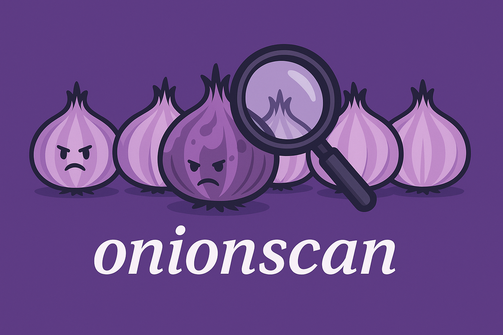

[](https://pkg.go.dev/github.com/nao1215/onionscan)
[](https://goreportcard.com/report/github.com/nao1215/onionscan)
[](https://github.com/nao1215/onionscan/actions/workflows/unit_test.yml)

[](https://github.com/nao1215/atago)

[](https://github.com/nao1215/onionscan/releases)

# OnionScan



OnionScan audits Tor v3 onion services for operational-security mistakes, exposed identity signals, vulnerable server configuration, and unexpected network services. It starts Tor for you or uses an existing SOCKS5 proxy, crawls the target, runs focused analyzers, and writes text, JSON, or Markdown reports.

This is a modern Go rewrite inspired by [s-rah/onionscan](https://github.com/s-rah/onionscan). It supports current 56-character onion addresses, concurrent scans, per-site configuration, scan history, and comparison reports.

> [!IMPORTANT]
> Use OnionScan only for services you own or are explicitly authorized to assess. You are responsible for complying with applicable laws and the target owner's rules.

## What it checks

| Area | Examples |
|------|----------|
| Identity leaks | Email addresses, social profiles, analytics IDs, cryptocurrency addresses |
| Sensitive material | Tor, SSH, cloud, API, and private-key patterns |
| Web metadata | EXIF data, server banners, external links, cloud resources |
| Browser behavior | Canvas, WebGL, WebRTC, AudioContext, redirects, hidden iframes |
| API exposure | OpenAPI, Swagger, GraphQL, debug endpoints, environment references |
| Web hardening | Security headers, CSP, cookies, TLS, Apache status pages |
| Network services | HTTP, HTTPS, SSH, FTP, SMTP, MongoDB, Redis, PostgreSQL, MySQL |

The crawler supports configurable depth, page limits, delays, response-size limits, headers, cookies, and allow or ignore patterns. Sensitive values in logs are redacted automatically.

## Requirements

- Go 1.25 or later when building from source
- A `tor` executable on `PATH`

Install Tor with the package manager for your platform:

```shell
# Ubuntu or Debian
sudo apt update
sudo apt install tor

# Fedora or RHEL
sudo dnf install tor

# Arch Linux
sudo pacman -S tor

# macOS
brew install tor

# Windows
choco install tor
```

## Install

### Homebrew

```shell
brew install nao1215/tap/onionscan
```

### Arch Linux (AUR)

```shell
yay -S onionscan-bin   # or: paru -S onionscan-bin
```

[`onionscan-bin`](https://aur.archlinux.org/packages/onionscan-bin) is community-maintained and installs the release binary.

### Go

```shell
go install github.com/nao1215/onionscan/cmd/onionscan@latest
```

### Source

```shell
git clone https://github.com/nao1215/onionscan.git
cd onionscan
go build -o onionscan ./cmd/onionscan
```

Release archives are available from the [GitHub Releases page](https://github.com/nao1215/onionscan/releases).

## Quick start

Scan one service with an automatically managed Tor process:

```shell
onionscan scan your-service.onion
```

Use a Tor daemon that is already running:

```shell
onionscan scan --external-tor 127.0.0.1:9050 your-service.onion
```

Scan several services concurrently:

```shell
onionscan scan --batch 3 first-service.onion second-service.onion third-service.onion
```

Write machine-readable or review-friendly reports:

```shell
onionscan scan --json --output report.json your-service.onion
onionscan scan --markdown --output report.md your-service.onion
```

Tune the crawl for an authorized test:

```shell
onionscan scan \
  --depth 25 \
  --max-pages 100 \
  --timeout 3m \
  --crawl-delay 2s \
  your-service.onion
```

Run `onionscan scan --help` for the complete command reference.

## Main scan options

| Flag | Short | Default | Purpose |
|------|-------|---------|---------|
| `--external-tor` | `-e` | embedded | Use a SOCKS5 proxy such as `127.0.0.1:9050` |
| `--tor-timeout` | `-T` | `3m` | Limit embedded Tor startup |
| `--timeout` | `-t` | `2m` | Limit each network operation |
| `--depth` | `-d` | `100` | Limit crawl recursion |
| `--max-pages` | `-p` | `100` | Limit pages per service |
| `--batch` | `-b` | `10` | Set concurrent target count |
| `--config` | `-c` | auto | Read a specific configuration file |
| `--json` | `-j` | off | Write JSON |
| `--markdown` | `-m` | off | Write Markdown |
| `--output` | `-o` | stdout | Write the report to a file |
| `--crawl-delay` | `-D` | `1s` | Pause between crawl requests |
| `--user-agent` | `-A` | `OnionScan/2.0` | Set the crawler User-Agent |
| `--max-body-size` | `-B` | `5 MiB` | Limit each response body |

When `--batch` is greater than `1`, site-specific cookies, headers, and depth settings are not applied. Use `--batch 1` when those settings are required.

## Configuration

Create a documented starter file:

```shell
onionscan init
```

OnionScan looks for `.onionscan` in the current directory and then the home directory. An explicit `--config` path must exist.

```yaml
defaults:
  cookie: ""
  depth: 50
  headers: {}
  ignore_patterns: []
  follow_patterns: []

sites:
  your-service.onion:
    cookie: "session_id=replace-me"
    headers:
      Authorization: "Bearer replace-me"
    depth: 20
    ignore_patterns:
      - "/logout"
      - "/admin/*"
    follow_patterns:
      - "/docs/*"
```

Restrict configuration-file permissions because cookies and authorization headers may be sensitive.

## Scan history and comparison

Every scan is stored in a local SQLite database. The location follows the XDG conventions used by the operating system.

| Platform | Default database path |
|----------|-----------------------|
| Linux | `~/.local/share/onionscan/onionscan.db` |
| macOS | `~/Library/Application Support/onionscan/onionscan.db` |
| Windows | `%LOCALAPPDATA%\onionscan\onionscan.db` |

Compare the latest two scans or inspect history:

```shell
onionscan compare your-service.onion
onionscan compare --list your-service.onion
onionscan compare --list-services
onionscan compare --with-scan-id 5 your-service.onion
onionscan compare --since 2026-01-01 your-service.onion
onionscan compare --json your-service.onion
onionscan compare --markdown your-service.onion
```

Comparison reports identify new, resolved, and unchanged findings and summarize whether risk improved, worsened, or stayed unchanged.

## Reports

The default text report is designed for terminals. JSON preserves structured scan data for automation. Markdown produces a reviewable report with severity summaries and detailed findings.

See [the Markdown report example](./doc/markdown-report.md).

Report files are created with owner-only permissions because they can contain sensitive findings.

## Testing

Run the fast Go test suite:

```shell
make test
```

Run the real CLI through [atago](https://github.com/nao1215/atago):

```shell
make e2e
```

The E2E suite builds a local HTTP fixture, exposes it as an ephemeral Tor v3 onion service with [tornago](https://github.com/nao1215/tornago), and points OnionScan at the fixture's own SOCKS5 proxy. It does not depend on a public onion site. The suite checks version output, configuration generation, JSON scanning, database persistence, and comparison behavior.

Generate one coverage profile from both Go unit tests and the atago-driven CLI runs:

```shell
make coverage
```

The command writes `coverage.out` and `coverage.html`. Real-Tor Go integration tests retained for focused debugging are opt-in:

```shell
make test-integration
```

## Troubleshooting

### Tor does not start

Check the installed binary and allow more bootstrap time:

```shell
tor --version
onionscan scan --tor-timeout 5m your-service.onion
```

You can also use an existing proxy with `--external-tor`.

### A service times out

Onion services can be slow or offline. Confirm the address in Tor Browser, then increase the request timeout or reduce crawl scope:

```shell
onionscan scan --timeout 5m --depth 10 --max-pages 50 your-service.onion
```

### A configuration file is rejected

When `--config` is present, OnionScan treats a missing file as an error. Remove the flag to use automatic discovery or provide the correct path.

## Related projects

- [nao1215/tornago](https://github.com/nao1215/tornago) provides the Tor process, client, and hidden-service APIs used by OnionScan.
- [nao1215/atago](https://github.com/nao1215/atago) verifies OnionScan's real CLI behavior from YAML scenarios.
- [s-rah/onionscan](https://github.com/s-rah/onionscan) is the original project that inspired this rewrite.

## Contributing

Contributions are welcome. Read [CONTRIBUTING.md](./CONTRIBUTING.md) before opening a change. Security reports should follow [SECURITY.md](./SECURITY.md).

If OnionScan is useful to you, star the repository or [sponsor the maintainer](https://github.com/sponsors/nao1215).

## Contributors ✨

Thanks goes to these wonderful people ([emoji key](https://allcontributors.org/docs/en/emoji-key)):

<!-- ALL-CONTRIBUTORS-LIST:START - Do not remove or modify this section -->
<!-- prettier-ignore-start -->
<!-- markdownlint-disable -->
<table>
  <tbody>
    <tr>
      <td align="center" valign="top" width="14.28%"><a href="https://debimate.jp/"><br /><sub><b>CHIKAMATSU Naohiro</b></sub></a><br /><a href="https://github.com/nao1215/onionscan/commits?author=nao1215" title="Code">💻</a> <a href="https://github.com/nao1215/onionscan/commits?author=nao1215" title="Documentation">📖</a></td>
      <td align="center" valign="top" width="14.28%"><a href="https://rafaeldominiquini.ddns.net/"><br /><sub><b>Rafael Baboni Dominiquini</b></sub></a><br /><a href="#platform-Dominiquini" title="Packaging/porting to new platform">📦</a></td>
    </tr>
  </tbody>
</table>

<!-- markdownlint-restore -->
<!-- prettier-ignore-end -->

<!-- ALL-CONTRIBUTORS-LIST:END -->

This project follows the [all-contributors](https://github.com/all-contributors/all-contributors) specification. Contributions of any kind welcome!

## License

[MIT License](./LICENSE)
