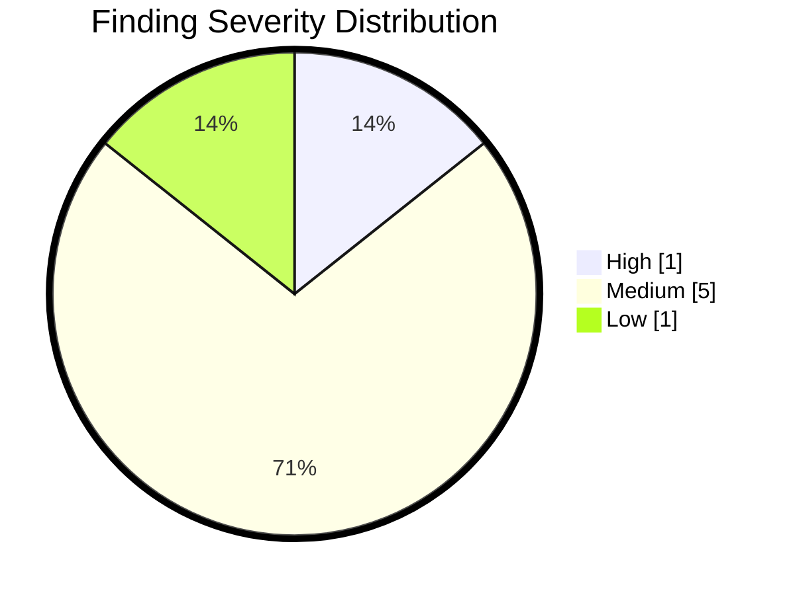

# OnionScan Report

| Property | Value |
|---------|---------|
| Hidden Service | `exampleonionserviceaddressv3xxxxxxxxxxxxxxxxxxxxxxxxxx.onion` |
| Scan Date | 2025-11-30 14:43:43 JST |
| Pages Crawled | 0 |
| Status | ✅ Complete |

## Severity Summary

| Severity | Count |
|---------|---------|
| 🔴 Critical | 0 |
| 🟠 High | 1 |
| 🟡 Medium | 5 |
| 🔵 Low | 1 |
| ⚪ Info | 0 |
| **Total** | **7** |

> [!WARNING]
> High severity issues detected. 1 high severity finding(s) should be addressed.

## Detected Services

No network services detected.

## Findings

### 🟠 High

| Title | Value | Location | Recommendation |
|---------|---------|---------|---------|
| Email Address Found | contact@example-onion.org | http://exampleonionserviceaddressv3xx... | - |

Email Address Found

An email address was found in page content. This could be used to identify the operator.

### 🟡 Medium

| Title | Value | Location | Recommendation |
|---------|---------|---------|---------|
| ETag May Leak Inode Number | "692a23da-468c" | https://exampleonionserviceaddressv3x... | - |
| Twitter/X Handle Reference Found | @example_handle | http://exampleonionserviceaddressv3xx... | - |
| CSP Allows Unsafe Inline Scripts | default-src 'none' ; connect-src  https://exam.... | http://exampleonionserviceaddressv3xx... | - |
| CSP Allows Unsafe Eval | default-src 'none' ; connect-src  https://exam.... | http://exampleonionserviceaddressv3xx... | - |
| CSP Allows External Domains | default-src 'none' ; connect-src  https://exam.... | http://exampleonionserviceaddressv3xx... | - |

ETag May Leak Inode Number

The ETag header appears to contain Apache-style weak tags that may include inode numbers.

Twitter/X Handle Reference Found

A Twitter/X @handle reference was found. This could indicate operator identity.

CSP Allows Unsafe Inline Scripts

The Content-Security-Policy allows 'unsafe-inline' scripts, which weakens XSS protection.

CSP Allows Unsafe Eval

The Content-Security-Policy allows 'unsafe-eval', which can be exploited for code injection.

CSP Allows External Domains

The Content-Security-Policy allows loading resources from external clearnet domains.

### 🔵 Low

| Title | Value | Location | Recommendation |
|---------|---------|---------|---------|
| HSTS Header on Onion Service | max-age=0 | http://exampleonionserviceaddressv3xx... | - |

HSTS Header on Onion Service

An HSTS header was found on an onion service. This is unusual since .onion addresses already provide end-to-end encryption. This could indicate the site has a clearnet mirror or the header is being used for tracking.

---

*Report generated by [OnionScan](https://github.com/nao1215/onionscan)*
